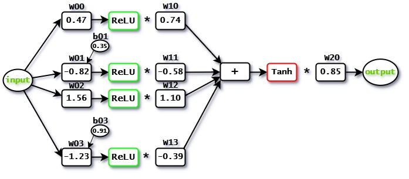

# My First Neural Network 🧠

A from-scratch implementation of a feedforward neural network built with **PyTorch**, trained using **Stochastic Gradient Descent (SGD)**. This project was built as a hands-on introduction to core deep learning concepts.



---

## What This Project Does

The notebook builds two networks with identical architectures:

1. **Reference Network** — fixed weights, used as the ground truth target
2. **Trainable Network** — initialized with slightly different weights, then trained via SGD to match the reference network's outputs

By the end of training, the trainable network's curve converges onto the reference network's curve.

---

## Network Architecture

```
Input → [ReLU Neuron × 4] → Sum → Tanh → Output
```

- **4 hidden neurons**, each performing: `ReLU(input × weight + bias)`
- Neurons 2 and 4 include a bias term
- Hidden outputs are summed → passed through `Tanh` → scaled by a final output weight
- **11 total parameters** (weights + biases)

---

## Training Details

| Setting       | Value          |
|---------------|----------------|
| Optimizer     | SGD            |
| Learning Rate | 0.01           |
| Loss Function | MSE Loss       |
| Epochs        | 828            |
| Input Range   | 1.0 → 2.5 (60 steps) |

---

## Project Structure

```
My-First-Neural-Network/
│
├── My_First_NN.ipynb      # Main notebook
├── Neural_Network.jpg     # Architecture diagram
├── requirements.txt       # Dependencies
└── README.md
```

---

## Getting Started

### 1. Clone the repo

```bash
git clone https://github.com/YOUR_USERNAME/My-First-Neural-Network.git
cd My-First-Neural-Network
```

### 2. Install dependencies

```bash
pip install -r requirements.txt
```

### 3. Run the notebook

```bash
jupyter notebook My_First_NN.ipynb
```

---

## Results

The notebook produces a final comparison plot showing how the trainable network's outputs shift from its initial state to closely match the reference network after training.

---

## Key Concepts Covered

- Manual parameter definition with `nn.Parameter`
- Forward pass through a custom `nn.Module`
- Gradient accumulation and `optimizer.zero_grad()`
- MSE loss and backpropagation
- Visualizing training progress with matplotlib & seaborn

---

## Requirements

See [`requirements.txt`](requirements.txt) for the full list.

---

## Author

**Mohamed Atef** — CS Student @ Assiut University
